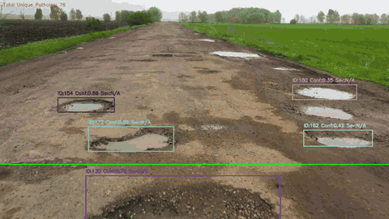
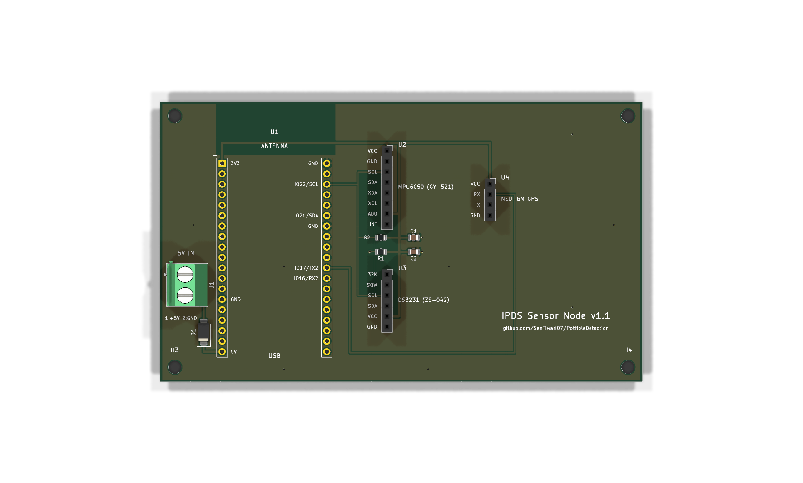

<div align="center">

# IPDS: Intelligent Pothole Detection System

**A low-cost dual-ESP32 + YOLOv8 rig that detects potholes in real time, tracks them, scores severity from accelerometer jerk, and logs them with GPS and timestamps.**

Research preprint · custom PCB · field log from Pune · runs without hardware too

[](LICENSE)
[](https://www.python.org/)
[](https://docs.ultralytics.com/)
[](https://github.com/SanTiwari07/PotHoleDetection/actions/workflows/ci.yml)
[](https://santiwari07.github.io/PotHoleDetection/)
[](https://zenodo.org/records/20760578)
[](https://colab.research.google.com/github/SanTiwari07/PotHoleDetection/blob/main/notebooks/quickstart.ipynb)
[](https://wokwi.com/projects/453817129999607809)
<!-- After deploying demo/ as a Hugging Face Space, add:
[](https://huggingface.co/spaces/<user>/<space>)
-->



<sub>YOLOv8m detections + SORT tracking on a sample road video. Each pothole keeps one ID and is logged once when it crosses the green reference line.</sub>

</div>

---

## Why IPDS?

Most pothole projects stop at "draw a box on an image". IPDS goes from camera to a **geo-tagged, severity-ranked maintenance log**:

- **Detect:** YOLOv8m fine-tuned for potholes (**mAP@0.5 = 81.7%**).
- **Track:** SORT (Kalman filter + Hungarian matching) gives every pothole a stable ID, so each one is **counted once**, not once per frame.
- **Feel:** when a tracked pothole reaches the wheel line, the hub queries a separate ESP32 sensor node for an **MPU6050 accelerometer burst** and computes peak jerk.
- **Fuse:** a pothole is only logged if the camera sees it **and** the accelerometer feels it. Its severity score (0–1) combines detection confidence (70%) with the measured impact (30%).
- **Log:** every event is written to CSV with timestamp (DS3231 RTC) and GPS fields, plus an annotated MP4.
- **Cheap:** two ESP32 boards and common breakout modules, under ₹2,500 per unit (as reported in the paper); inference runs on a laptop.

## Try it in 30 seconds

| Option | What you get | Hardware needed |
|---|---|---|
| [](https://colab.research.google.com/github/SanTiwari07/PotHoleDetection/blob/main/notebooks/quickstart.ipynb) | Run detection + tracking on a sample image or your own video | None |
| [**Wokwi simulation**](https://wokwi.com/projects/453817129999607809) | The ESP32 sensor node (MPU6050, NEO-6M GPS, DS3231) running in your browser | None |
| [`demo/app.py`](demo/) | Gradio web UI for images and videos (deployable as a Hugging Face Space) | None |
| Local install (below) | The full pipeline: offline on video, or live with ESP32 boards | Optional |

### Local quickstart

```bash
git clone https://github.com/SanTiwari07/PotHoleDetection.git
cd PotHoleDetection
pip install -r requirements.txt

# Vision-only on any road video (weights auto-download on first run)
python python/main.py --source path/to/road_video.mp4
```

Outputs land in `outputs/videos/` (annotated MP4) and `outputs/logs/` (CSV). Press `q` to stop; add `--no-display` on servers.

---

## How it works

```
┌──────────────────┐   WiFi / MJPEG    ┌───────────────────────────────┐
│  ESP32-CAM       │ ────────────────► │  Python processing hub        │
│  (Vision node)   │                   │                               │
│  OV2640 camera   │                   │  YOLOv8m ─► SORT tracker      │
└──────────────────┘                   │       │                       │
                                       │       ▼  pothole crosses line │
┌──────────────────┐   WiFi / HTTP     │  query sensor node (burst)    │
│  ESP32 dev board │ ◄───────────────► │       │                       │
│  (Sensor node)   │  /query?id=N      │       ▼                       │
│  MPU6050  NEO-6M │  ◄── JSON ──      │  severity fusion ─► CSV + MP4 │
│  DS3231 RTC      │                   └───────────────────────────────┘
└──────────────────┘
```

**Why two ESP32s?** Reading I²C sensors on the ESP32-CAM blocks `esp_camera_fb_get()` and tanks the frame rate. Moving all sensor I/O to a second, event-driven board keeps the video stream smooth, and both boards stay cheap.

| Step | Where | What happens |
|---|---|---|
| 1 | ESP32-CAM | Streams 320×240 MJPEG frames over WiFi |
| 2 | Hub | YOLOv8m detects → SORT assigns persistent IDs |
| 3 | Hub | Holds back tracks that are too large (> 25% of frame), too wide (aspect ratio > 3) or stationary for more than 10 frames |
| 4 | Hub | When a track's centre crosses the reference line, sends `GET /query?pothole_id=N` |
| 5 | Sensor node | Returns accelerometer, RTC timestamp and GPS fields as JSON |
| 6 | Hub | Computes peak jerk. No impact means the event is rejected; otherwise it computes severity, appends a CSV row and annotates the video |

### Severity scoring

```
jerk_norm = min(peak_jerk / 20 m/s³, 1)
severity  = 0.7 × YOLO confidence + 0.3 × jerk_norm
```

These are Eqs. 6–7 of the paper, implemented in [`python/pothole_detection/fusion.py`](python/pothole_detection/fusion.py). Events whose peak jerk is below `--jerk-threshold` (default 1.5 m/s³; calibrate it for your vehicle) are rejected by the fusion gate. In offline mode there is no sensor node, so the gate is skipped, severity is vision-only, and the jerk/GPS columns are left empty.

Deep dives: [Architecture](docs/ARCHITECTURE.md) · [Hardware & wiring](docs/HARDWARE.md) · [Full technical spec](docs/DETAIL.md) · [Paper (PDF)](docs/IPDS_Pothole_Detection.pdf)

---

## Results

### Model (validation split)

| mAP@0.5 | mAP@0.5:0.95 | Precision | Recall |
|:---:|:---:|:---:|:---:|
| **81.68%** | **55.95%** | **82.33%** | **74.42%** |

YOLOv8m, 640×640 input, single class (`pothole`), trained on the [Pothole Detection dataset by andrewmvd on Kaggle](https://www.kaggle.com/datasets/andrewmvd/pothole-detection) (665 images with bounding boxes; Pascal VOC XML converted to YOLO format; 598 training / 67 validation images). Weights: [Releases → v1.0](https://github.com/SanTiwari07/PotHoleDetection/releases/tag/v1.0).

```python
from ultralytics import YOLO
model = YOLO("assets/models/pothole_yolov8.pt")
model.predict("road.jpg", conf=0.25)[0].show()
```

### Reproduce the model

```bash
# 1. Download and unzip https://www.kaggle.com/datasets/andrewmvd/pothole-detection
python training/prepare_dataset.py --src path/to/pothole-detection   # VOC XML -> YOLO, 598 train / 67 val
python training/train.py                                              # YOLOv8m, 640px, 100 epochs, AdamW
```

The best checkpoint is copied to `assets/models/pothole_yolov8.pt` and validation metrics are printed at the end. The split sizes match the paper, but the paper doesn't publish which images were in each split, so your metrics may differ slightly.

### System performance (reported in the paper)

| Measure | Result |
|---|---|
| Inference speed | 10–15 FPS on a CPU-only laptop (320×240 input) |
| Latency, frame capture → CSV row | ~170–200 ms |
| Hardware cost | under ₹2,500 per unit |

The paper also reports false-positive trials (shadows, manhole covers, speed bumps and others); see [docs/DETAIL.md](docs/DETAIL.md#7-reported-system-results-paper).

### Sample field log (20 March 2026, Pune)

[`outputs/sample_logs/output.csv`](outputs/sample_logs/output.csv) has 50 logged potholes from a drive between 1:56 and 2:08 pm. This file records severity as text bands by peak jerk, while the current `main.py` writes the numeric 0–1 score instead:

| Band | Peak jerk in the file | Rows | Share |
|---|---|:---:|:---:|
| Low | 1.6 – 2.7 | 8 | 16% |
| Medium | 3.0 – 5.9 | 22 | 44% |
| High | 6.0 – 9.4 | 20 | 40% |

<details>
<summary>CSV column reference</summary>

| Column | Description |
|---|---|
| `date`, `time` | Detection timestamp (DS3231 RTC; falls back to host clock) |
| `frame_id` | Video frame number when the event was triggered |
| `pothole_id` | Unique SORT track ID |
| `confidence` | YOLOv8 detection confidence (0–1) |
| `bounding_box_area` | Box area in px² |
| `aspect_ratio` | Box width / height |
| `peak_jerk` | Peak jerk from the MPU6050 burst (m/s³; empty in offline mode) |
| `severity` | Severity score 0–1 (the sample file uses Low / Medium / High bands instead) |
| `latitude`, `longitude` | WGS-84 position from the NEO-6M (`0` without a GPS fix; empty in offline mode) |

</details>

---

## Build the hardware

| Component | Role |
|---|---|
| **ESP32-CAM** (AI-Thinker, OV2640) | Vision node: continuous MJPEG stream |
| **ESP32 dev board** | Sensor node: answers HTTP queries on demand |
| **MPU6050** | 6-axis IMU: peak jerk while crossing the pothole |
| **NEO-6M GPS** | Latitude / longitude |
| **DS3231 RTC** | Accurate timestamps without internet |
| **Laptop or edge device** | Runs YOLOv8 inference (e.g. Jetson Nano) |

### Sensor-node wiring

| Module pin | ESP32 pin |
|---|---|
| MPU6050 SDA / DS3231 SDA | GPIO21 (+ 4.7 kΩ pull-up to 3V3) |
| MPU6050 SCL / DS3231 SCL | GPIO22 (+ 4.7 kΩ pull-up to 3V3) |
| MPU6050 **AD0** | **3V3** (sets address 0x69; the DS3231 already uses 0x68) |
| NEO-6M TX → | GPIO16 (RX2) |
| NEO-6M RX ← | GPIO17 (TX2) |
| All VCC / GND | 3V3 / GND |

**Custom PCB:** a 2-layer carrier board for the ESP32-DevKitC and the three modules is in [`KiCad/IPDS_SensorNode/`](KiCad/IPDS_SensorNode/). It passes KiCad's ERC/DRC with 0 violations, and ready-to-order Gerbers, a BOM and a schematic PDF are in its `fabrication/` folder. Interactive diagrams: [`Diagrams/`](Diagrams/).

<p align="center"></p>

### Setup

1. **WiFi credentials.** Both boards and the laptop join the same network (a phone hotspot works):
   ```bash
   cp .env.example .env        # then edit WIFI_SSID / WIFI_PASSWORD
   python update_wifi.py       # generates credentials.h for both sketches (git-ignored)
   ```
2. **Flash the firmware** with Arduino IDE 2.x + ESP32 core 3.x (sensor node also needs the `RTClib` and `TinyGPSPlus` libraries):

   | Sketch | Board |
   |---|---|
   | [`ESP_32_Code/esp_32_cam_final/`](ESP_32_Code/esp_32_cam_final/) | AI-Thinker ESP32-CAM |
   | [`ESP_32_Code/esp_32_final/`](ESP_32_Code/esp_32_final/) | ESP32 Dev Module |

3. **Set the device IPs** printed on each Serial Monitor (115200 baud) in `.env` (`ESP32_CAM_IP`, `ESP32_SENSOR_IP`). Open `http://<sensor-ip>/` in a browser to check that the MPU6050, RTC and GPS are all detected (the GPS needs a clear sky view for its first fix).
4. **Calibrate the MPU6050** once, mounted in the vehicle: flash [`ESP_32_Code/mpu6050_calibration`](ESP_32_Code/mpu6050_calibration/), paste the printed offsets into `esp_32_final.ino` and re-flash it ([details](docs/HARDWARE.md#mpu6050-calibration)).
5. **Run live:**
   ```bash
   python python/main.py --live
   ```

### All CLI options

| Flag | Default | Description |
|---|---|---|
| `--source` | first `.mp4` in `assets/videos/` | Offline mode: video path or webcam index |
| `--live` | off | Stream from the ESP32-CAM and query the sensor node |
| `--cam-ip`, `--sensor-ip` | from `.env` | Override device IPs |
| `--model` | `assets/models/pothole_yolov8.pt` | Weights (auto-downloaded if missing) |
| `--conf` | `0.25` | Detection confidence threshold |
| `--jerk-threshold` | `1.5` | Live mode: minimum peak jerk (m/s³) that confirms an impact |
| `--output-dir` | `outputs/` | Where the MP4 and CSV are written |
| `--no-display` | off | Headless mode |

---

## Repository structure

```text
PotHoleDetection/
├── python/
│   ├── main.py                    # Entry point: detection → tracking → fusion → logging
│   └── pothole_detection/
│       ├── detector.py            # YOLOv8 wrapper
│       ├── tracker.py             # SORT wrapper with unique-ID counting
│       ├── sort.py                # SORT (Bewley et al., GPL-3.0)
│       ├── filters.py             # Area / aspect-ratio / persistence filters
│       └── fusion.py              # Jerk, fusion gate, severity score
├── ESP_32_Code/
│   ├── esp_32_cam_final/          # Vision node firmware (MJPEG server)
│   ├── esp_32_final/              # Sensor node firmware (HTTP /query API)
│   └── mpu6050_calibration/       # One-time MPU6050 offset calibration
├── PotHoleSimu/                   # Wokwi simulation of the sensor node
├── demo/                          # Gradio app / Hugging Face Space
├── notebooks/quickstart.ipynb     # Colab quickstart
├── training/                      # Dataset conversion + YOLOv8 training scripts
├── KiCad/                         # Sensor-node schematic and PCB
├── Diagrams/                      # Interactive HTML block diagrams
├── index.html                     # Project website (GitHub Pages)
├── docs/                          # Architecture, hardware, full spec, paper PDF
├── outputs/sample_logs/           # Field-test CSV
├── tests/                         # Unit tests (pytest)
├── update_wifi.py                 # .env → credentials.h generator
└── .env.example                   # Config template (copy to .env)
```

---

## Roadmap

Contributions welcome! See [CONTRIBUTING.md](CONTRIBUTING.md).

- [ ] Smartphone / dashcam mode (no ESP32 needed)
- [ ] Export detections to GeoJSON / OpenStreetMap
- [ ] Edge deployment on Coral TPU / Hailo-8 / Jetson
- [ ] Docker image for the processing hub
- [ ] Web dashboard with a live pothole heatmap
- [ ] Segmentation model for pothole area / depth estimation

---

## Citation

If you use IPDS in your research, please cite the paper ([Zenodo record](https://zenodo.org/records/20760578)) or the software:

```bibtex
@software{tiwari2026ipds,
  author    = {Tiwari, Sanskar and Bansod, Swarali and Kognole, Eshwari and Shinde, Shruti},
  title     = {Real-Time Pothole Detection Based on Vision-Dominant Sensor Fusion
               and Dual ESP32 Architecture},
  year      = {2026},
  version   = {1.0.0},
  license   = {MIT},
  url       = {https://github.com/SanTiwari07/PotHoleDetection}
}
```

A machine-readable [`CITATION.cff`](CITATION.cff) is included; GitHub's **"Cite this repository"** button uses it.

## Authors

Department of Electronics and Telecommunication Engineering, **Pune Institute of Computer Technology (PICT)**, Pune, India.

| Name | Role |
|---|---|
| **Sanskar Tiwari** | Core architecture & ML pipeline |
| **Swarali Bansod** | Sensor integration & firmware |
| **Eshwari Kognole** | Hardware design & testing |
| **Shruti Shinde** | Data collection & validation |

## License

Project code is released under the [MIT License](LICENSE).

Third-party components keep their own licenses: [`sort.py`](python/pothole_detection/sort.py) is © Alex Bewley under **GPL-3.0**, and [Ultralytics YOLOv8](https://github.com/ultralytics/ultralytics) is **AGPL-3.0**.

---

<div align="center">

# ⭐

### If IPDS is useful to you, please consider giving it a ⭐ on GitHub. It helps others find the project!

[](https://star-history.com/#SanTiwari07/PotHoleDetection&Date)

</div>
